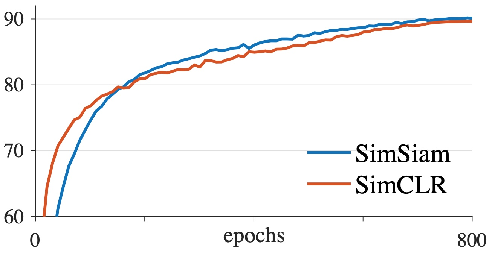
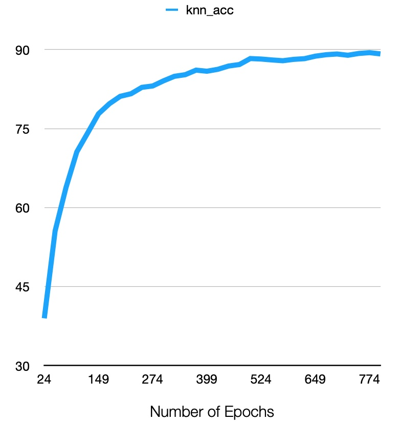

# SimSiam
This is an _Unofficial_ PyTorch implementation of **Exploring Simple Siamese Representation Learning [1]**. It is highly inspired by [PatrickHua's repository](https://github.com/PatrickHua/SimSiam). The key features in this implementations are

1. It supports DistributedDataParallel (DDP) -- not the old fashion DataParallel
2. It separates the loss function (criteria) from the model. Thus, it is easier to modify the loss function (e.g., add a regularizer) without changing the model.
3. It automatically switches between the CIFAR-ResNet and the official ResNet based on the training dataset.
4. The code supports both CIFAR10 and CIFAR100

## Requirements

* Python 3+ [Tested on 3.7]
* PyTorch 1.x [Tested on 1.7.1]

## Usage example

First update `constants.py` with your dataset dir and checkpoints dir

To train a model `python pretrain_main.py` 

To train a linear classifier `python classifier_main.py` -- Make sure to update the path of the [pretrained model](https://github.com/ahmdtaha/simsiam/blob/1975eb6749cc06d1df2a781b4ed9c234ad008c40/classifier_main.py#L107) before running.

The CIFAR hyperparameters are already hard coded in the python script. However these hyperparameters can be overridden by providing at least one parameter when running the script (e.g., `python pretrain_main.py --arch SimCLR`) 

By default the code leverage DistributedDataParallel. The are two key parameters to identify the training GPUs
* `--world_size` denotes how many GPUs to use
* `--base_gpu` denotes what is the start GPU index (0-based). 
  
For example if a machine has four GPUs, and user sets world_size=3 and base_gpu=1, the model will be trained on the 2nd, 3rd and 4th GPUs.

The code logs the training progress in two files

* train_X.log: Assuming base_gpu=X, the file contains text log of the training progress. There are sample log files inside ./sample_runs dir. These are complete/incomplete runs.
* exp_name.csv: This csv file keeps track of the KNN accuracy at each `--test_interval`

### Quantitative Evaluation on CIFAR10

|                   | Paper [1] | Ours |
|-------------------|------------|-------------|
|     KNN Accracy     |||
|     Linear Classifier     |91.8| [90.27](https://github.com/ahmdtaha/simsiam/blob/main/sample_runs/complete_linear_classifier_run.txt) |

## Release History
* 1.0.0
    * First commit on 8 Jan 2021

### TODO LIST
* Revise the readme file
* Test pretrain_main.py with SimCLR
* ~~Add the `classifier_main.py`~~

## References
[1] Chen, Xinlei and He, Kaiming. Representation Learning by Learning to Count. arXiv preprint arXiv:2011.10566 
